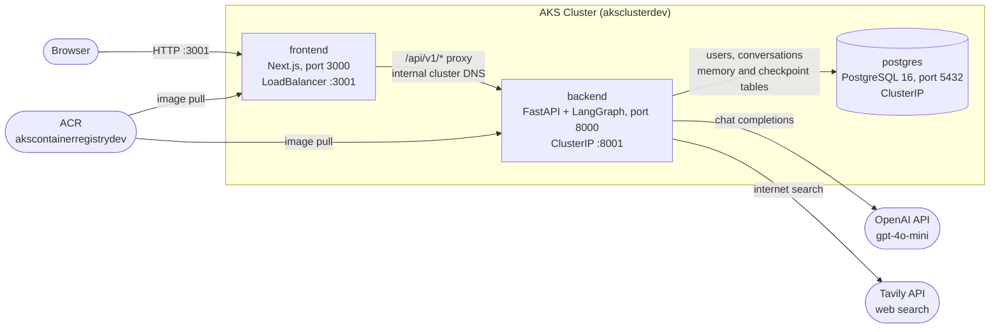
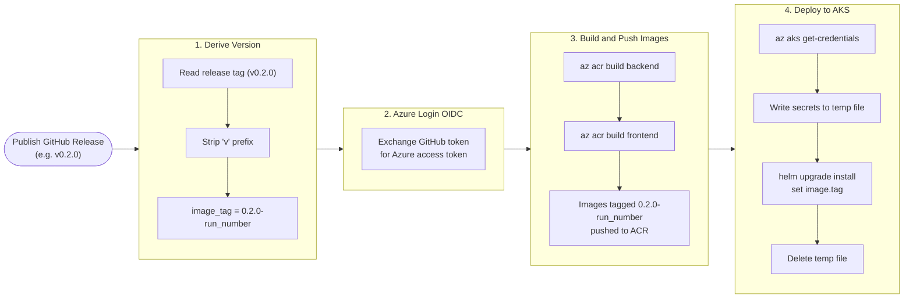
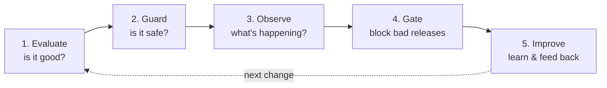

# Chatbot on AKS

A production-grade AI chatbot that walks through the **full lifecycle of an LLM application** — from building and deploying it on Azure Kubernetes Service (AKS) to keeping it good in production with the **AIOps loop**. It is an educational reference: every stage maps to a clearly named folder you can open and run.

There are two halves to the story:

1. **Build & deploy** — versioning, containerisation, pushing to a private registry, and rolling out to AKS, all triggered by a single git push (Phases 1–3 below).
2. **AIOps** — what you do *after* it's live to keep the AI reliable: evaluate answer quality, guard against misuse, observe behaviour, and improve over time (see [After Deployment: The AIOps Loop](#after-deployment-the-aiops-loop)).

---

## Table of Contents

- [Architecture Overview](#architecture-overview)
- [How It Works](#how-it-works)
  - [Memory System](#memory-system)
  - [Request Flow](#request-flow)
- [Getting Started](#getting-started)
- [Phase 1 — Provision Infrastructure](#phase-1--provision-infrastructure)
- [Phase 2 — Configure GitHub Actions CI/CD](#phase-2--configure-github-actions-cicd)
- [Phase 3 — Publish a Release to Deploy](#phase-3--publish-a-release-to-deploy)
- [Manual Deployment to AKS](#manual-deployment-to-aks)
- [After Deployment: The AIOps Loop](#after-deployment-the-aiops-loop)
- [Next Steps](#next-steps)

---

## Architecture Overview

The application is made up of three services that run as pods in an AKS cluster:



- **frontend** (LoadBalancer) — the only entry point from the browser. Serves the React UI and reverse-proxies all `/api/v1/*` traffic to the backend so the backend is never directly exposed.
- **backend** (ClusterIP) — validates JWTs, persists chat history, and runs the LangGraph AI agent.
- **postgres** (ClusterIP) — stores application tables (`users`, `conversations`) and all LangGraph short-term and long-term memory tables. Data is persisted on an Azure Disk via the `managed-csi` StorageClass (built into AKS).
- **ACR** (`akscontainerregistrydev`) — private container registry. AKS pulls images from here using its managed identity.
- **OpenAI API** — chat completions via `gpt-4o-mini`, called at agent runtime.
- **Tavily API** — real-time web search tool available to the agent.

---

## How It Works

### Memory System

The agent has two layers of memory, both persisted in PostgreSQL:

| Layer | Mechanism | What is stored |
|---|---|---|
| **Short-term** | LangGraph `PostgresSaver` (checkpointer) | Full message history for the current conversation thread; automatically summarised when the context exceeds 4 000 tokens |
| **Long-term** | LangGraph `PostgresStore` | User-specific facts and preferences saved across all conversations |

On startup, the backend calls `init_agent()` which runs `store.setup()` and `checkpointer.setup()` to create the required LangGraph tables in Postgres if they do not exist yet.

The agent is given four tools:

- `get_user_info` — reads the user's long-term memory from the store
- `save_user_info` — writes new facts about the user to the store
- `internet_search` — performs a live web search via the Tavily API
- `search_user_documents` — semantic search (RAG) over files the user has uploaded; documents are chunked, embedded, and stored as vectors in Postgres via the `pgvector` extension

### Request Flow

1. The browser loads the React UI from the frontend pod.
2. Any `/api/v1/*` request is rewritten by Next.js and forwarded to `http://backend-service:8001` inside the cluster — the browser never reaches the backend directly.
3. The backend validates the JWT on every protected endpoint.
4. On a chat message, the backend saves the user message to Postgres, runs the LangGraph agent (which may call OpenAI, Tavily, or search the user's uploaded documents), saves the AI reply, and returns it.
5. The frontend renders the reply as a new message bubble.

---

## Getting Started

Deploying this project for the first time involves three phases done in order:

1. **Provision infrastructure** (manual, once) — runs entirely in your terminal. First you use the **Azure CLI** to create a storage account for Terraform remote state, then you use **Terraform** to provision the resource group, ACR, and AKS cluster.
2. **Configure CI/CD** (manual, once) — runs entirely in your terminal. You use the **Azure CLI** to create an App Registration, add a federated OIDC credential, and grant the required roles; then you add four secrets to GitHub.
3. **Publish a release to deploy** (automatic from here on) — publishing a GitHub Release triggers the pipeline, which builds, tags (from the release tag), pushes images, and rolls out to AKS without any further manual steps.

---

## Phase 1 — Provision Infrastructure

> **This phase is manual and run once from your terminal.** There is no automation — you execute the Azure CLI and Terraform commands below directly. After this phase is complete, all subsequent deployments happen automatically through GitHub Actions.

The `terraform/` directory at the root of the repo already contains three configuration files:

| File | Contents |
|---|---|
| [terraform/main.tf](terraform/main.tf) | AzureRM provider, resource group, ACR, AKS cluster, AcrPull role assignment |
| [terraform/variables.tf](terraform/variables.tf) | Tuneable values: region, cluster name, node count, VM size |
| [terraform/outputs.tf](terraform/outputs.tf) | Values printed after apply: ACR login server, kubectl command |

The defaults in `variables.tf` match everything used in this README (`rg-gen-project`, `akscontainerregistrydev`, `aksclusterdev`). Edit them if you want different names.

### Prerequisites

- [Azure CLI](https://learn.microsoft.com/en-us/cli/azure/install-azure-cli)
- [Terraform ≥ 1.7](https://developer.hashicorp.com/terraform/install)

---

### Part A — Azure CLI: Create remote state storage

Terraform needs an Azure Storage Account to store state before `terraform init` can use the remote backend. Run these commands once:

```bash
az login

az group create \
  --name rg-chatbot-tfstate \
  --location "Germany West Central"

az storage account create \
  --name chatbottfstate2026ali \
  --resource-group rg-chatbot-tfstate \
  --location "Germany West Central" \
  --sku Standard_LRS

az storage container create \
  --name tfstate \
  --account-name chatbottfstate2026ali

# Save this key — you need it as ARM_ACCESS_KEY in Phase 2
az storage account keys list \
  --account-name chatbottfstate2026ali \
  --resource-group rg-chatbot-tfstate \
  --query '[0].value' -o tsv
```

### Part B — Terraform: Provision AKS & ACR

**Step 1 — Enable the remote backend**

Uncomment the `backend "azurerm"` block in `terraform/main.tf` (the names already match the storage account above):

```hcl
backend "azurerm" {
  resource_group_name  = "rg-chatbot-tfstate"
  storage_account_name = "chatbottfstate2026ali"
  container_name       = "tfstate"
  key                  = "chatbot.tfstate"
}
```

**Step 2 — Apply**

```bash
cd terraform

# Download the AzureRM provider plugin and configure the remote backend
terraform init

# Preview every resource that will be created — review before proceeding
terraform plan -out=tfplan

# Create the resource group, ACR, and AKS cluster (~4 minutes)
terraform apply tfplan
```

After a successful apply Terraform prints:

```
Outputs:

acr_login_server        = "akscontainerregistrydev.azurecr.io"
aks_cluster_name        = "aksclusterdev"
aks_kube_config_command = "az aks get-credentials --resource-group rg-gen-project --name aksclusterdev --overwrite-existing"
resource_group_name     = "rg-gen-project"
```

**Step 3 — Configure kubectl**

Run the command from the `aks_kube_config_command` output:

```bash
az aks get-credentials \
  --resource-group rg-gen-project \
  --name aksclusterdev \
  --overwrite-existing

kubectl get nodes   # should list 2 nodes in Ready state
```

### Teardown

```bash
cd terraform
terraform destroy
```

> **Warning:** this deletes the resource group and everything inside it, including any persistent volumes. Make sure you no longer need the data before running this.

---

## Phase 2 — Configure GitHub Actions CI/CD

> **This phase is manual and run once from your terminal.** You use the Azure CLI throughout — no portal clicks required.

The workflow in [.github/workflows/deploy.yml](.github/workflows/deploy.yml) needs two things before it can run:

- **OIDC trust** between GitHub Actions and Azure so the runner can authenticate without a stored password.
- **Five GitHub Secrets** containing the values the workflow reads at runtime.

Both are set up once. All commands below assume the infrastructure from Phase 1 is already in place.

### 2a — Wire up OIDC authentication

The workflow uses [Workload Identity Federation](https://docs.github.com/en/actions/security-for-github-actions/security-hardening-your-deployments/configuring-openid-connect-in-azure): the GitHub Actions runner exchanges its short-lived OIDC token for an Azure access token — **no long-lived client secrets are stored anywhere**.

**Step 1 — Log in and define all variables**

Run this block once. Every subsequent step in this section uses these variables, so keep the terminal session open.

```bash
az login

# ── Captured from Azure ────────────────────────────────────────────────────
SUBSCRIPTION_ID=$(az account show --query id -o tsv)
TENANT_ID=$(az account show --query tenantId -o tsv)

# ── Project values (edit GH_ORG and GH_REPO to match your repository) ─────
RESOURCE_GROUP="rg-gen-project"
AKS_CLUSTER="aksclusterdev"
ACR_NAME="akscontainerregistrydev"
GH_ORG="<your-github-username-or-org>"
GH_REPO="<your-repo-name>"

# ── Print the values you will need as GitHub Secrets ──────────────────────
echo "AZURE_SUBSCRIPTION_ID: $SUBSCRIPTION_ID"
echo "AZURE_TENANT_ID:        $TENANT_ID"
```

**Step 2 — Create an App Registration for GitHub Actions**

```bash
APP_ID=$(az ad app create --display-name "github-actions-chatbot" --query appId -o tsv)
OBJECT_ID=$(az ad app show --id "$APP_ID" --query id -o tsv)

az ad sp create --id "$APP_ID"

echo "AZURE_CLIENT_ID: $APP_ID"   # → save as GitHub Secret
```

**Step 3 — Add a Federated Credential (trust the main branch)**

This tells Azure to accept tokens issued by GitHub Actions for your `main` branch.

```bash
az ad app federated-credential create \
  --id "$OBJECT_ID" \
  --parameters "{
    \"name\": \"github-main\",
    \"issuer\": \"https://token.actions.githubusercontent.com\",
    \"subject\": \"repo:${GH_ORG}/${GH_REPO}:ref:refs/heads/main\",
    \"audiences\": [\"api://AzureADTokenExchange\"]
  }"
```

**Step 4 — Grant the required Azure roles**

```bash
SP_OBJECT_ID=$(az ad sp show --id "$APP_ID" --query id -o tsv)
ACR_ID=$(az acr show --name "$ACR_NAME" --resource-group "$RESOURCE_GROUP" --query id -o tsv)
AKS_ID=$(az aks show --name "$AKS_CLUSTER" --resource-group "$RESOURCE_GROUP" --query id -o tsv)

# AcrPush — allows the runner to push built images to the registry
az role assignment create \
  --assignee-object-id "$SP_OBJECT_ID" \
  --assignee-principal-type ServicePrincipal \
  --role AcrPush \
  --scope "$ACR_ID"

# Contributor on ACR — needed to trigger ACR Tasks (az acr build)
az role assignment create \
  --assignee-object-id "$SP_OBJECT_ID" \
  --assignee-principal-type ServicePrincipal \
  --role Contributor \
  --scope "$ACR_ID"

# AKS Cluster User — allows fetching kubeconfig so Helm can deploy
az role assignment create \
  --assignee-object-id "$SP_OBJECT_ID" \
  --assignee-principal-type ServicePrincipal \
  --role "Azure Kubernetes Service Cluster User Role" \
  --scope "$AKS_ID"
```

### 2b — Add GitHub Secrets

Go to **GitHub → your repo → Settings → Secrets and variables → Actions** and create the following secrets:

| Secret name | Value | Where to get it |
|---|---|---|
| `AZURE_CLIENT_ID` | App Registration client ID | `echo $APP_ID` from Step 2 |
| `AZURE_TENANT_ID` | Azure AD tenant ID | `echo $TENANT_ID` from Step 1 |
| `AZURE_SUBSCRIPTION_ID` | Your subscription ID | `echo $SUBSCRIPTION_ID` from Step 1 |
| `HELM_VALUES_SECRETS` | Full contents of `values-secrets.yaml` | See below |

> **Note — evaluation gate:** two more secrets are needed if you enable the quality gate.
> On the **Secrets tab** add `LANGSMITH_API_KEY` ([smith.langchain.com](https://smith.langchain.com) → Settings → API Keys)
> and `OPENAI_API_KEY` ([platform.openai.com](https://platform.openai.com) → API keys).
> Then on the **Variables tab** create `RUN_EVAL_GATE = true`.

For `HELM_VALUES_SECRETS`, copy `k8s/aks/chart/values-secrets.yaml.example`, fill in real values, and paste the entire YAML as the secret value:

```yaml
secrets:
  postgres:
    password: "your-strong-password"
  backend:
    secretKey: "output-of-openssl-rand-hex-32"
    openaiApiKey: "sk-..."
    tavilyApiKey: "tvly-..."
    langsmithApiKey: ""   # optional — leave empty to disable runtime tracing
```

---

## Phase 3 — Publish a Release to Deploy

Once Phases 1 and 2 are complete, **publish a GitHub Release** and the pipeline runs automatically. The workflow file is [.github/workflows/deploy.yml](.github/workflows/deploy.yml).

Go to your repo → **Releases** (right sidebar) → **Draft a new release** → choose a tag like `v0.2.0` → **Publish release**. The pipeline triggers immediately and uses the release tag as the image version (e.g. `v0.2.0` → images tagged `0.2.0-<run_number>`).

> Or from the terminal: `gh release create v0.2.0 --title "v0.2.0" --notes "first release"`

### Why CI/CD matters for an LLM application

An AI application has build-time concerns a traditional web app does not:

- **External API keys** (OpenAI, Tavily) must reach the runtime environment securely — they cannot be baked into an image.
- **Model behaviour changes** with prompt or dependency updates, requiring the same disciplined versioning and rollout process as any other code change.
- **Dependency churn** in the LLM ecosystem (LangChain, LangGraph, etc.) makes reproducible, automated builds essential.

The pipeline treats the entire stack — frontend, backend, and the agent's prompts and tools — as a single versioned artefact that is built, tagged, pushed, and deployed atomically.

### Pipeline stages



**Stage 1 — Derive version**: reads the release tag (e.g. `v0.2.0`), strips the leading `v`, and appends the run number to form the image tag (`0.2.0-42`). Every build is uniquely traceable to the exact pipeline run that produced it.

**Stage 2 — Azure login (OIDC)**: uses `azure/login@v2` to exchange the runner's short-lived GitHub token for an Azure access token using the OIDC trust set up in Phase 2. No passwords or client secrets touch the runner.

**Stage 3 — Build and push images**: runs `az acr build` for both the backend and frontend. The Docker build executes **inside Azure** (ACR Tasks) — no Docker daemon is needed on the runner and no registry credentials are ever handled by the workflow. Images are pushed to `akscontainerregistrydev.azurecr.io`.

**Stage 4 — Deploy to AKS**: fetches cluster credentials with `az aks get-credentials`, writes the `HELM_VALUES_SECRETS` GitHub Secret to a temporary file, runs `helm upgrade --install` with the new image tags injected via `--set`, then immediately deletes the temp file. This is a rolling update — Kubernetes replaces pods one at a time with zero downtime.

---

## Manual Deployment to AKS

Use this path to deploy without the CI/CD pipeline — for example when testing locally or if GitHub Actions is not yet configured. This assumes the infrastructure from [Phase 1](#phase-1--provision-infrastructure-with-terraform) is already in place.

### Prerequisites

- [Azure CLI](https://learn.microsoft.com/en-us/cli/azure/install-azure-cli) installed and logged in (`az login`)
- [kubectl](https://kubernetes.io/docs/tasks/tools/) installed
- [Helm 3](https://helm.sh/docs/intro/install/) installed

---

### Step 1 — Connect to the AKS cluster

Download the cluster credentials and set `kubectl` to point at AKS:

```bash
az login

az aks get-credentials \
  --resource-group rg-gen-project \
  --name aksclusterdev \
  --overwrite-existing
```

Verify `kubectl` is talking to the right cluster:

```bash
kubectl get nodes
# NAME                                STATUS   ROLES   AGE   VERSION
# aks-nodepool1-xxxxxxxx-vmss000000   Ready    agent   ...   ...
```

> **Tip — multiple clusters:** If you also use Docker Desktop or another cluster, `az aks get-credentials` adds an AKS entry to your kubeconfig. Switch between them with:
> ```bash
> kubectl config get-contexts          # list all
> kubectl config use-context aksclusterdev   # switch to AKS
> ```

---

### Step 2 — Check your AKS node architecture

ACR Tasks always builds on AMD64 machines. If your AKS node pool uses ARM64 (e.g. Azure Cobalt/Ampere VMs), you must pass `--platform linux/arm64` so the emulated build targets the correct architecture — otherwise pods will crash with `exec format error`.

Check what your nodes are running:

```bash
kubectl get nodes -o jsonpath='{range .items[*]}{.metadata.name}{"\t"}{.status.nodeInfo.architecture}{"\n"}{end}'
```

Use the result to set the platform variable:

```bash
# arm64 nodes → linux/arm64
# amd64 nodes → linux/amd64
PLATFORM="linux/arm64"
```

---

### Step 3 — Build and push images to ACR

Run these from the repo root. Both builds happen inside Azure (ACR Tasks) — no local Docker daemon required.

```bash
ACR="akscontainerregistrydev"
TAG="0.1.2-manual"

# Backend
az acr build --registry $ACR \
  --image chatbot/backend:$TAG \
  --platform $PLATFORM \
  --file backend/Dockerfile .

# Frontend
az acr build --registry $ACR \
  --image chatbot/frontend:$TAG \
  --platform $PLATFORM \
  --file frontend/Dockerfile \
  ./frontend
```

> **Note:** ARM64 builds take 5–10 minutes because ACR Tasks uses QEMU emulation. AMD64 builds complete in under a minute.

Verify both tags exist in the registry:

```bash
az acr repository show-tags --name $ACR --repository chatbot/backend --output table
az acr repository show-tags --name $ACR --repository chatbot/frontend --output table
```

You can also confirm in the Azure Portal: **Container registries → akscontainerregistrydev → Repositories**.

---

### Step 4 — Create the secrets values file

```bash
cp k8s/aks/chart/values-secrets.yaml.example k8s/aks/chart/values-secrets.yaml
```

Open `k8s/aks/chart/values-secrets.yaml` and fill in every value:

| Field | How to set |
|---|---|
| `secrets.postgres.password` | Any strong password |
| `secrets.backend.secretKey` | `openssl rand -hex 32` |
| `secrets.backend.openaiApiKey` | Your OpenAI API key (`sk-...`) |
| `secrets.backend.tavilyApiKey` | Your Tavily API key (`tvly-...`) |

`values-secrets.yaml` is listed in `.gitignore` and `.helmignore` — it will never be committed.

---

### Step 5 — Deploy to AKS with Helm

This single command creates all Kubernetes resources (Deployments, Services, StatefulSet, Secrets, ConfigMaps):

```bash
helm upgrade --install chatbot k8s/aks/chart \
  -f k8s/aks/chart/values-secrets.yaml \
  --set backend.image.tag=$TAG \
  --set frontend.image.tag=$TAG
```

---

### Step 6 — Wait for pods to become Ready

```bash
kubectl get pods --watch
# NAME                                   READY   STATUS    RESTARTS   AGE
# backend-deployment-xxxxxxxxx-xxxxx     1/1     Running   0          60s
# frontend-deployment-xxxxxxxxx-xxxxx    1/1     Running   0          60s
# postgres-0                             1/1     Running   0          60s
```

All three pods should reach `Running` with `READY 1/1` within a couple of minutes. Press `Ctrl+C` to stop watching.

If a pod is stuck in `Pending` or `CrashLoopBackOff`, inspect it:

```bash
kubectl describe pod <pod-name>   # events and error messages
kubectl logs <pod-name>           # application logs
```

---

### Step 7 — Get the external IP and update CORS

The frontend is exposed via a LoadBalancer. Azure takes ~60 seconds to assign a public IP:

```bash
kubectl get service frontend-service --watch
# NAME               TYPE           CLUSTER-IP    EXTERNAL-IP      PORT(S)
# frontend-service   LoadBalancer   10.0.x.x      <pending>        3001:...
# frontend-service   LoadBalancer   10.0.x.x      20.x.x.x         3001:...
```

Once the `EXTERNAL-IP` is no longer `<pending>`, copy it and update `k8s/aks/chart/values.yaml`:

```yaml
backend:
  config:
    allowedOrigins: '["http://<EXTERNAL-IP>:3001"]'
```

Then redeploy to apply the CORS change:

```bash
helm upgrade --install chatbot k8s/aks/chart \
  -f k8s/aks/chart/values-secrets.yaml \
  --set backend.image.tag=$TAG \
  --set frontend.image.tag=$TAG
```

---

### Step 8 — Open the app

Navigate to **http://\<EXTERNAL-IP\>:3001** in your browser. You should see the login page.

---

### Teardown

```bash
helm uninstall chatbot

# Delete the Postgres persistent volume only if you want to wipe all data:
kubectl delete pvc postgres-data-postgres-0

# Detach ACR from AKS if no longer needed:
az aks update \
  --name aksclusterdev \
  --resource-group rg-gen-project \
  --detach-acr akscontainerregistrydev
```

---

## After Deployment: The AIOps Loop

Building and deploying the chatbot is only half the job. **AIOps** (for LLM applications, also called **LLMOps**) is everything you do to keep an AI app *good* once it is live.

Why does an LLM app need this when a normal web app doesn't? Because an LLM's answers can quietly get **worse** — from a prompt tweak, a new model version, or simply a kind of question you never tested — and nothing crashes to warn you. There is no exception, no red error, no failing health check. The only way to know is to **measure quality directly and keep watching**. That is why AIOps is a **loop you keep running**, not a one-time setup.

There are five vital steps. Each already has a home in this repo:

| Step | In one sentence | Where it lives |
|---|---|---|
| **1. Evaluate** | Automatically score answer quality — is it *correct*, *on-topic*, and *grounded* in real sources? | [evaluation/](evaluation/) |
| **2. Guard** | Block bad **inputs** (prompt injection) and bad **outputs** (leaked PII, off-topic replies). | [evaluation/guardrails/](evaluation/guardrails/) |
| **3. Observe** | Trace every request to see latency, token **cost**, which tools were used, and errors. | [notebooks/](notebooks/) + LangSmith |
| **4. Gate** | Put Evaluate + Guard inside CI so a change that lowers quality **cannot deploy**. | [agentops.yaml](agentops.yaml) |
| **5. Improve** | Collect user feedback (👍/👎), find weak spots, add them to the test set — then loop back to step 1. | the loop closes |

How to read it as one sentence: **Evaluate** tells you if the bot is good → **Guard** keeps it safe in the moment → **Observe** shows what's really happening in production → **Gate** stops regressions from shipping → **Improve** feeds what you learn back in. Round and round.



### 1. Evaluate — measure answer quality

Traditional tests check *exact* outputs, but an LLM can phrase the same correct answer a thousand ways, so you grade it instead. This project uses **LLM-as-judge** evaluation: a second model scores each answer on three axes — **correctness** (does it match the reference?), **relevance** (does it actually address the question?), and **groundedness** (are the claims supported by retrieved context, not invented?). The scoring functions live in [evaluation/metrics.py](evaluation/metrics.py) and run against a fixed set of question/answer pairs, the *golden dataset* ([evaluation/golden_dataset.jsonl](evaluation/golden_dataset.jsonl)). Run it locally with `make eval`, or explore it interactively in [notebooks/evaluation.ipynb](notebooks/evaluation.ipynb).

### 2. Guard — protect at runtime

Evaluation tells you the bot is good *on average*; guardrails protect each individual request *right now*. They work on both ends: checking the **user's input** for prompt-injection or jailbreak attempts ("ignore your instructions and…"), and checking the **bot's output** for problems before it reaches the user — leaked personal data (PII) or replies that wander off the intended domain. Each guardrail is a small, focused module: [prompt_injection.py](evaluation/guardrails/prompt_injection.py), [pii_check.py](evaluation/guardrails/pii_check.py), and [off_topic.py](evaluation/guardrails/off_topic.py). They matter because an LLM will, by default, follow any instruction it's given and happily repeat sensitive text — guardrails are the boundary that stops it.

### 3. Observe — see what's really happening

Once real users arrive, you need to see *inside* each request: how long it took, how many tokens it burned (tokens = money), which tools the agent called, and whether anything errored. This is **tracing**, and the project gets it almost for free — LangGraph emits a full trace of every agent run to **LangSmith** once tracing is enabled (`LANGSMITH_TRACING=true`). The [notebooks/observability_monitoring.ipynb](notebooks/observability_monitoring.ipynb) notebook shows how to browse traces, drill into a single run step-by-step, and build a monitoring summary of latency, cost, and error rate. Without this, an LLM app is a black box — you'd have no idea why a reply was slow, expensive, or wrong.

### 4. Gate — stop bad changes from shipping

Steps 1 and 2 are only useful if they can actually *block* a bad release. The **evaluation gate** wires them into CI: [evaluation/run_eval.py](evaluation/run_eval.py) runs the evaluation, compares each score against the thresholds in [agentops.yaml](agentops.yaml), and exits with a failure code if any metric falls short — which fails the pipeline and stops the deploy. This is the LLM equivalent of "all tests must pass before merge": you decide, in one config file, the minimum quality bar (e.g. "≥ 80% of answers must be correct"), and the pipeline enforces it on every change.

### 5. Improve — close the loop

Finally, production teaches you things your test set never will. Real users click 👍/👎, and that feedback (captured in LangSmith — see the feedback cell in the observability notebook) points straight at the weak spots. The discipline is simple: take the questions the bot got wrong, add them to the golden dataset, and now every future release is automatically checked against those cases too. The test set grows, the quality bar holds, and you start again at step 1 — which is exactly what makes it a *loop*.

---

## Next Steps

The following improvements can be layered on top of the current project without restructuring the existing architecture.

### Monitoring

A production AI application needs visibility at two distinct levels:

**Infrastructure monitoring**
Standard Kubernetes observability: CPU, memory, and pod restarts. The Azure Monitor workspace and managed Grafana instance already present in the `rg-gen-project` resource group can be connected to AKS directly from the portal (Monitoring → Insights). The existing `GET /api/v1/health` endpoint is a ready-made liveness probe target.

**LLM-level monitoring**
Infrastructure metrics alone cannot reveal prompt regressions or model quality drift. LLM-specific observability covers: token usage and cost per user/conversation, response latency broken down by model call vs. tool call, tool invocation rates (`internet_search`, `get_user_info`, `save_user_info`), and summarisation trigger frequency. Tools such as [LangSmith](https://smith.langchain.com/) or self-hosted [Langfuse](https://langfuse.com/) can be integrated with minimal code changes — LangGraph emits traces automatically once the relevant environment variables are set.

### Bring Your Own Key (BYOK)

Currently all users share the platform's OpenAI API key, injected as a cluster secret at deploy time. A BYOK model would let each user supply their own key at registration (or via a profile settings page), which is then stored encrypted in Postgres and used in place of the platform key at inference time.

This removes the operator's OpenAI cost exposure entirely. The main changes required are: an encrypted `openai_api_key` column on the `users` table, a backend endpoint to save/update the key, refactoring the agent from a global singleton into a per-request instance that receives the user's key, and a settings UI in the frontend. The rest of the stack — the CI/CD pipeline, Kubernetes manifests, LangGraph memory system, and Helm chart — is unaffected.

### Stop and restart the cluster

Stopping the cluster deallocates the nodes and pauses compute billing without losing any data or configuration.

```bash
# Stop
az aks stop --name aksclusterdev --resource-group rg-gen-project

# Start again
az aks start --name aksclusterdev --resource-group rg-gen-project
